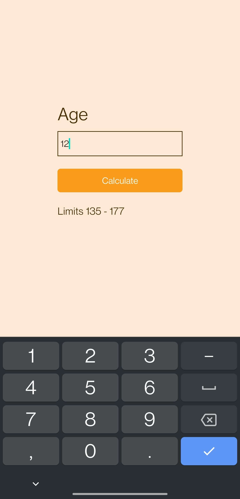

# Heart Rate Calculator
React Native application helps user to calculate heart rate limits based on given age.
Following formula to determines the lower and upper limits:

- Lower Limit: (220 - age) * 0.65
- Upper Limit: (220 - age) * 0.85

 
